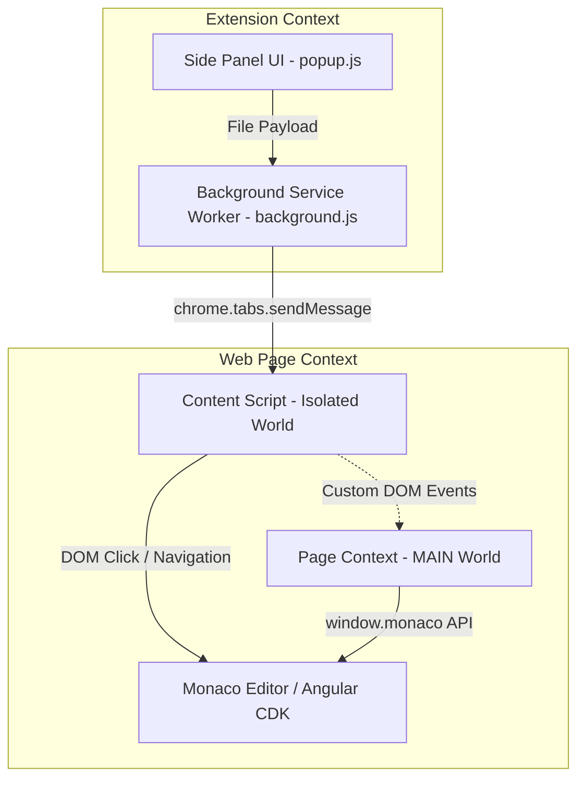

# AI Studio Git Sync

<p align="center">
  
</p>

**AI Studio Git Sync** is a powerful, lightweight Google Chrome Extension designed to perform **one-directional synchronization** of your local workspace folders or GitHub repositories directly into the Monaco Web IDE ("Code" tab) inside **Google AI Studio** (external-towards-browser only).

This extension solves the common issue of managing workspace diffs in Google AI Studio by allowing you to edit files locally in your favorite editor (VS Code, Cursor, etc.) or pull the latest changes directly from GitHub, and push changes to the browser instantly. It supports collapsible folder structures, prominent auto-save integration, active Git auto-detection, a visual diff viewer, and a beautiful native light/dark theme.

---

## 🎯 The Problem & Why This Was Built

Google AI Studio's built-in Git panel allows you to commit changes made in the web IDE back to GitHub, but it **lacks a way to pull or sync external changes** back into your web editor. 

This creates several major pain points for developers:
1. **Reverse Diff Issues**: If you edit your project files locally or pull updates from GitHub, Google AI Studio's web environment remains unaware of these changes. When you try to use the built-in Git tool, it interprets the newly modified external files as conflict diffs or tries to revert them on your next commit.
2. **Repetitive Copy-Pasting**: Previously, to update AI Studio with changes you made in VS Code, you had to open each file tab, copy the local code, paste it manually, and repeat this for every modified file.
3. **No Support for New/Deleted Files**: Merging new files added externally into AI Studio's context was difficult and often failed to register in the workspace tree.

**AI Studio Git Sync** solves this by acting as a fast, automated sync bridge. By clicking **Sync** or running a **Full Diff Check**, the extension instantly overwrites the web workspace files with your local or GitHub source code, updates Monaco's model state programmatically, and triggers Web IDE auto-saves. This allows you to work in your favorite local IDE while keeping AI Studio in perfect sync.

---

## Technical Architecture & Core Logics

The extension is designed around Google Chrome's Manifest V3 architecture, utilizing a multi-layered communication bridge to interact safely with the Google AI Studio page.



### 1. Persistent Folder Access (Side Panel API)
*   **The Problem**: Standard Chrome action popups are transient. If you click outside the popup window, the browser destroys its execution context. This immediately revokes any local folder permissions granted via the File System Access API (`showDirectoryPicker()`), forcing the user to grant permission repeatedly.
*   **The Solution**: We migrated the UI to the Chrome **Side Panel API** (`chrome.sidePanel`). Side panels remain alive and active even when the user clicks away, switches tabs, or focuses on another application. This preserves the local folder directory handle throughout the session.

### 2. Isolated vs. MAIN World Script Injection (Bypassing CSP)
*   **The Problem**: Google AI Studio runs a strict **Content Security Policy (CSP)** that forbids executing inline scripts (e.g., `<script>/*code*/</script>` or string-based injections like `chrome.scripting.executeScript({ func: ... })` with dynamic code strings). However, we must access the global `window.monaco` object to write file contents safely. Content scripts default to an **Isolated World** where they cannot read page variables like `window.monaco`.
*   **The Solution**: We registered a separate file script `src/page-context.js` running in the **MAIN world** via `manifest.json`. Since the script is bundled locally inside the extension package and loaded as a static file, it is trusted by the browser and complies with the page's CSP.
*   **Bridge Communication**:
    *   `content.js` (Isolated World) receives the local file content.
    *   It dispatches a custom DOM event `SyncFileToMonaco` containing the file details to `window`.
    *   `page-context.js` (MAIN World) intercepts the event, modifies the active Monaco model, triggers a save action, and responds with a `SyncFileToMonacoResult` event.

### 3. Deep Folder Navigation
*   To edit a file, the extension splits its relative workspace path (e.g. `src/components/Button.tsx`) and recursively crawls the sidebar tree (`mat-tree` / `mat-tree-node`). It automatically checks if parent folders are expanded (`aria-expanded="true"`), clicks them if closed, waits for DOM nodes to render, and finally selects the target file.

### 4. Direct Monaco API Integration
*   Rather than attempting unreliable copy-paste commands, the page-context script accesses `window.monaco.editor.getEditors()`.
*   It polls the editors for up to 2 seconds to wait until the active model URI matches the synced file.
*   Once matched, it calls `activeEditor.setValue(text)` and dispatches a programmatic `Ctrl+S` keyboard event to the editor's textarea, triggering the app's internal auto-save hooks.
*   If the Monaco API fails, the script automatically falls back to DOM textarea insertion.

### 5. Advanced Simulated File Upload (New Files)
For new files that do not exist yet in the Web IDE workspace, the extension falls back to a simulated drag-and-drop file upload:
*   **CDK Event Mocking**: Angular CDK drag-and-drop (`cdkdroplist`) checks that `event.dataTransfer.types` contains `'Files'` and that `event.dataTransfer.files` contains items. Chrome blocks setting these on synthetic events for security. We bypass this by overriding the getters of the `DataTransfer` instance via `Object.defineProperty`.
*   **`webkitGetAsEntry` Mocking**: Modern Web IDEs check `item.webkitGetAsEntry()` to support folder structure uploads. We mock `webkitGetAsEntry` to return a fake `FileSystemFileEntry` object containing the file content and its relative path.
*   **Dynamic Inputs / Overlay Triggering**: The script dispatches `dragenter` and `dragover` events to trigger the app's dynamic upload overlays, waits **100ms** for any dynamic file inputs to render, feeds the file directly into native `<input type="file">` tags using a clean `DataTransfer` instance, and fires the final `drop` event to complete the upload.

### 6. Project-Scoped Workspaces & Tab-Level Domain Restriction
*   **Domain Restriction**: The extension is built to run exclusively on Google AI Studio. By omitting `default_path` in `manifest.json` and managing paths programmatically, the service worker enables the side panel and active toolbar actions **only** on tabs with `aistudio.google.com`. When navigating to other domains (e.g. `google.com`), the extension icon grays out and the side panel automatically closes/hides.
*   **Scope Memory**: Instead of using a single global folder handle, `popup.js` parses the active URL's project app ID (e.g., `/apps/<app-id>`) and creates a unique storage key (`workspaceHandle_${appId}`).
*   **Auto-Update on Switch**: The side panel registers listeners for tab changes (`chrome.tabs.onActivated`) and loading (`chrome.tabs.onUpdated`). Switching between different tabs instantly refreshes the folder and files shown in the side panel according to the active project.
*   **Auto-Save Toggle**: Introduces an "Auto Save changes" switch in the extension header. When enabled, syncing changes programmatically triggers Monaco save shortcuts (`Ctrl+S`) and clicks the workspace-wide bottom "Save" button. When disabled, the files are synced to the editors but require the user to review and press "Save" manually.
*   **Collapsible Folder Tree**: Replaces the flat file list with a high-fidelity hierarchical tree structure mimicking a code editor's sidebar. Folders can be expanded and collapsed dynamically by clicking, directories are sorted before files, and indentations are guided by visual dashed lines. Includes "Expand All" and "Collapse All" actions.
*   **Dual Mode Sync (Local vs. GitHub)**:
    *   **Local Workspace**: Select a folder locally using the browser's File System Access API.
    *   **GitHub Sync**: Connect to GitHub to retrieve the latest repository changes directly from the server.
    *   **Auto-Detection**: Scans the active AI Studio tab's DOM for Git configuration (e.g. `owner/repo on branch` in the Git pane) and automatically configures the sync target.
    *   **Private Repositories**: Supports entering a Personal Access Token (PAT) which is required for private repositories.
    *   **Recursive File Tree**: Fetches repo structure via the GitHub Git Trees API and syncs files on-demand using the Git Blobs API.
*   **Interactive Git Diff Viewer**:
    *   Adds a dedicated "Diff" button next to files in the file tree view.
    *   Compares the local workspace file content or the GitHub file content against the active Monaco editor model in Google AI Studio.
    *   Provides a clean line-by-line colored diff visualization overlay (modal) inside the side panel to review additions (`+`) and removals (`-`) before committing changes.
    *   Includes light/dark theme compatibility for diff displays.
*   **Google AI Studio Theme Integration (Material Design 3)**:
    *   Designed to blend seamlessly inside Google AI Studio's side panel using the official Material Design 3 guidelines with a cute yet clean, minimalistic layout.
    *   Supports matching color schemes (Google Blue `#0b57d0` / `#38bdf8`, rounded pill buttons, and background tokens) for both dark and light modes.
    *   Decorated with a slim Google color accent line, subtle springy interactive elements, and custom extension-aware file icons (e.g. 🟦 for TypeScript, 🟨 for JavaScript, 🌐 for HTML, 🎨 for CSS, 📝 for Markdown).
    *   Features a highly prominent **Auto Save** status card at the top, styled with active brand colors for quick visibility.
    *   Includes a dark and light mode toggle switch, persisting the active theme preference inside `chrome.storage.local`.

---

## Chrome Web Store Policy Compliance Analysis

If you plan to publish this extension publicly on the Chrome Web Store, you should be aware of the following security review and policy implications:

### ✅ Least Privilege & Host Permissions (Resolved)
*   **Current Setup**: The `manifest.json` host permissions and content script matches are restricted strictly to `"https://aistudio.google.com/*"`. 
*   **Chrome Policy**: The Chrome Web Store enforces a strict **Least Privilege Policy**. Extensions targeting specific sites must declare only those sites. By eliminating broad wildcards (like `*://*/*`), we satisfy this requirement. This ensures faster security reviews and avoids automatic flags or rejection during publication.

### 🚩 MAIN World Script Injection Scrutiny
*   **Chrome Policy**: Injecting code into the MAIN world increases the extension's attack surface since malicious scripts on a web page can access extension variables or trigger extension functions.
*   **How We Comply**: We do not export any Chrome Extension APIs (like `chrome.runtime`) into the MAIN world script. Communication is strictly unidirectional using `CustomEvent` payloads. No private authentication tokens or sensitive extension states are passed to the page context.

### 🚩 Remote Code Execution (RCE) Ban
*   **Chrome Policy**: Manifest V3 strictly prohibits extensions from loading or executing remotely hosted code (such as downloading scripts from external servers or executing strings using `eval()`).
*   **How We Comply**: All script files (`content.js`, `page-context.js`) are packaged and bundled locally inside the extension. By avoiding dynamic string evaluation, the extension fully complies with MV3 safety guidelines.

---

## Local Development & Setup

1. Clone the repository and navigate into it:
   ```bash
   cd ai-studio-git-sync
   ```
2. Install dependencies:
   ```bash
   npm install
   ```
3. Run the development server (enables HMR for background/popup assets):
   ```bash
   npm run dev
   ```
4. Build the production package:
   ```bash
   npm run build
   ```
5. Open Chrome, go to `chrome://extensions/`, enable **Developer mode**, click **Load unpacked**, and select the `dist` folder generated by the build.

---

## 🔮 Future Roadmap

*   **Bidirectional Synchronization**:
    *   Integrate [isomorphic-git](https://isomorphic-git.org/) (a pure JavaScript Git implementation) inside the extension context to support reading commits, checking branches, and pushing changes from Google AI Studio back to GitHub or local workspaces.
*   **Automatic GitHub Credential Extraction**:
    *   Examine internal session states and IndexedDB storage within Google AI Studio to reuse the existing authenticated GitHub connection. This would eliminate the need for users to manually supply a Personal Access Token (PAT) for private repositories.
