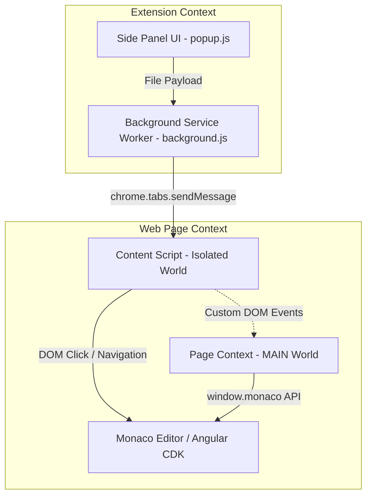

# Google AI Studio Git & Local Workspace Syncer

A lightweight Google Chrome Extension designed to synchronize your local workspace folder directly with the Web IDE ("Code" tab) inside **Google AI Studio**. 

This extension solves the common issue of managing workspace diffs in Google AI Studio by allowing you to edit files locally in your favorite editor (VS Code, Cursor, etc.) and push changes to the browser instantly with a single click.

---

## Technical Architecture & Core Logics

The extension is designed around Google Chrome's Manifest V3 architecture, utilizing a multi-layered communication bridge to interact safely with the Google AI Studio page.



### 1. Persistent Folder Access (Side Panel API)
*   **The Problem**: Standard Chrome action popups are transient. If you click outside the popup window, the browser destroys its execution context. This immediately revokes any local folder permissions granted via the File System Access API (`showDirectoryPicker()`), forcing the user to grant permission repeatedly.
*   **The Solution**: We migrated the UI to the Chrome **Side Panel API** (`chrome.sidePanel`). Side panels remain alive and active even when the user clicks away, switches tabs, or focuses on another application. This preserves the local folder directory handle throughout the session.

### 2. Isolated vs. MAIN World Script Injection (Bypassing CSP)
*   **The Problem**: Google AI Studio runs a strict **Content Security Policy (CSP)** that forbids executing inline scripts (e.g., `<script>/*code*/</script>` or string-based injections like `chrome.scripting.executeScript({ func: ... })` with dynamic code strings). However, we must access the global `window.monaco` object to write file contents safely. Content scripts default to an **Isolated World** where they cannot read page variables like `window.monaco`.
*   **The Solution**: We registered a separate file script `src/page-context.js` running in the **MAIN world** via `manifest.json`. Since the script is bundled locally inside the extension package and loaded as a static file, it is trusted by the browser and complies with the page's CSP.
*   **Bridge Communication**:
    *   `content.js` (Isolated World) receives the local file content.
    *   It dispatches a custom DOM event `SyncFileToMonaco` containing the file details to `window`.
    *   `page-context.js` (MAIN World) intercepts the event, modifies the active Monaco model, triggers a save action, and responds with a `SyncFileToMonacoResult` event.

### 3. Deep Folder Navigation
*   To edit a file, the extension splits its relative workspace path (e.g. `src/components/Button.tsx`) and recursively crawls the sidebar tree (`mat-tree` / `mat-tree-node`). It automatically checks if parent folders are expanded (`aria-expanded="true"`), clicks them if closed, waits for DOM nodes to render, and finally selects the target file.

### 4. Direct Monaco API Integration
*   Rather than attempting unreliable copy-paste commands, the page-context script accesses `window.monaco.editor.getEditors()`.
*   It polls the editors for up to 2 seconds to wait until the active model URI matches the synced file.
*   Once matched, it calls `activeEditor.setValue(text)` and dispatches a programmatic `Ctrl+S` keyboard event to the editor's textarea, triggering the app's internal auto-save hooks.
*   If the Monaco API fails, the script automatically falls back to DOM textarea insertion.

### 5. Advanced Simulated File Upload (New Files)
For new files that do not exist yet in the Web IDE workspace, the extension falls back to a simulated drag-and-drop file upload:
*   **CDK Event Mocking**: Angular CDK drag-and-drop (`cdkdroplist`) checks that `event.dataTransfer.types` contains `'Files'` and that `event.dataTransfer.files` contains items. Chrome blocks setting these on synthetic events for security. We bypass this by overriding the getters of the `DataTransfer` instance via `Object.defineProperty`.
*   **`webkitGetAsEntry` Mocking**: Modern Web IDEs check `item.webkitGetAsEntry()` to support folder structure uploads. We mock `webkitGetAsEntry` to return a fake `FileSystemFileEntry` object containing the file content and its relative path.
*   **Dynamic Inputs / Overlay Triggering**: The script dispatches `dragenter` and `dragover` events to trigger the app's dynamic upload overlays, waits **100ms** for any dynamic file inputs to render, feeds the file directly into native `<input type="file">` tags using a clean `DataTransfer` instance, and fires the final `drop` event to complete the upload.

---

## Chrome Web Store Policy Compliance Analysis

If you plan to publish this extension publicly on the Chrome Web Store, you should be aware of the following security review and policy implications:

### ✅ Least Privilege & Host Permissions (Resolved)
*   **Current Setup**: The `manifest.json` host permissions and content script matches are restricted strictly to `"https://aistudio.google.com/*"`. 
*   **Chrome Policy**: The Chrome Web Store enforces a strict **Least Privilege Policy**. Extensions targeting specific sites must declare only those sites. By eliminating broad wildcards (like `*://*/*`), we satisfy this requirement. This ensures faster security reviews and avoids automatic flags or rejection during publication.

### 🚩 MAIN World Script Injection Scrutiny
*   **Chrome Policy**: Injecting code into the MAIN world increases the extension's attack surface since malicious scripts on a web page can access extension variables or trigger extension functions.
*   **How We Comply**: We do not export any Chrome Extension APIs (like `chrome.runtime`) into the MAIN world script. Communication is strictly unidirectional using `CustomEvent` payloads. No private authentication tokens or sensitive extension states are passed to the page context.

### 🚩 Remote Code Execution (RCE) Ban
*   **Chrome Policy**: Manifest V3 strictly prohibits extensions from loading or executing remotely hosted code (such as downloading scripts from external servers or executing strings using `eval()`).
*   **How We Comply**: All script files (`content.js`, `page-context.js`) are packaged and bundled locally inside the extension. By avoiding dynamic string evaluation, the extension fully complies with MV3 safety guidelines.

---

## Local Development & Setup

1. Clone the repository and navigate into it:
   ```bash
   cd ai-studio-git-sync
   ```
2. Install dependencies:
   ```bash
   npm install
   ```
3. Run the development server (enables HMR for background/popup assets):
   ```bash
   npm run dev
   ```
4. Build the production package:
   ```bash
   npm run build
   ```
5. Open Chrome, go to `chrome://extensions/`, enable **Developer mode**, click **Load unpacked**, and select the `dist` folder generated by the build.
